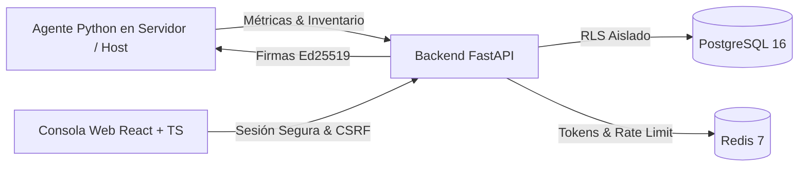

# Manual Integral de Operación y Administración: NEXUS IT

---

## 1. Introducción y Arquitectura

**NEXUS IT** es una plataforma empresarial para la supervisión continua de infraestructura, soporte técnico, mesa de ayuda y operaciones remotas con aislamiento estricto multiempresa mediante **PostgreSQL Row-Level Security (RLS)** y firmas criptográficas asimétricas **Ed25519**.



---

## 2. Módulos Operativos y Flujos de Trabajo

### 2.1. Panel Principal (Dashboard)
- **KPIs en Tiempo Real:** Visualización del porcentaje de dispositivos en línea, incidentes activos, tickets pendientes y estado de postura de seguridad.
- **Gráficos de Telemetría:** Monitoreo del consumo promedio de procesador (CPU %) y memoria RAM de la flota.
- **Alertas y Tickets Recientes:** Acceso rápido a los últimos incidentes críticos y solicitudes abiertas.

---

### 2.2. Inventario y Supervisión de Dispositivos
1. **Registro de Equipos:**
   - Desde la pestaña **Dispositivos**, pulse **"Registrar Dispositivo"**.
   - Indique el *Hostname* (ej. `srv-db-01`) y una etiqueta descriptiva opcional.
2. **Generación de Token de Agente:**
   - Al registrar el equipo, se genera un token criptográfico HMAC-SHA256 con *pepper* del servidor.
   - Copie el token en el momento; por diseño de seguridad de conocimiento cero (*zero-knowledge*), el secreto nunca se almacena en texto plano en la base de datos.
3. **Pestañas de Detalle del Dispositivo:**
   - **Telemetría en Vivo:** Gráficos históricos de CPU, RAM y disco.
   - **Hardware & Software:** Procesador, memoria física total, lista completa de paquetes instalados y parches aplicados.
   - **Servicios:** Estado y tipo de inicio de servicios del sistema operativo monitoreados.
   - **Asignación:** Vinculación directa a un colaborador de la organización.

---

### 2.3. Centro de Alertas y Motor de Umbrales
- **Alertas Activas:** Listado de incidentes en estado `OPEN` o `ACKNOWLEDGED` clasificados por severidad (`CRITICAL`, `WARNING`, `INFO`).
- **Historial de Incidentes:** Registro histórico con marcas de tiempo de activación y resolución.
- **Reglas de Alerta con Anti-Flapping:**
  - Permite definir umbrales personalizados (ej. `system.cpu.usage > 90%`).
  - **Ventana de persistencia (*Duration Seconds*):** Exige que la condición se mantenga durante $N$ segundos antes de disparar la alerta, evitando alertas espurias por picos transitorios.

---

### 2.4. Mesa de Ayuda y Soporte Técnico (Tickets)
1. **Creación de Tickets:**
   - Registro de requerimientos clasificados por prioridad (`LOW`, `MEDIUM`, `HIGH`, `CRITICAL`) con vinculación opcional a un dispositivo o alerta.
2. **Flujo de Transición de Estados:**
   - `OPEN` $\to$ `IN_PROGRESS` $\to$ `RESOLVED` $\to$ `CLOSED`.
   - Transiciones verificadas en backend con control de estado esperado previo (*optimistic concurrency*).
3. **Notas Internas Privadas:**
   - Los analistas y administradores pueden publicar comentarios con la casilla **"Nota Interna"** activada, visibles únicamente para el equipo de TI y ocultas para el usuario final.
4. **Adjuntos Seguros:**
   - Subida y descarga de archivos de diagnóstico (`.png`, `.log`, `.pdf`, etc.) con validación binaria en stream, nombres ofuscados en disco y cabeceras de prevención MIME (`X-Content-Type-Options: nosniff`).

---

### 2.5. Consola de Acciones Remotas (Catálogo Cerrado)
NEXUS IT implementa un modelo **anti-RCE** estricto donde no se permite la ejecución de comandos arbitrarios.

1. **Solicitud de Operación:**
   - El operador selecciona una acción del catálogo cerrado:
     - `system.reboot` (Reinicio del sistema - requiere aprobación obligatoria).
     - `service.restart` (Reinicio de servicio específico, ej. `nginx`).
     - `process.kill` (Finalización de proceso por PID).
     - `diagnostics.collect` (Recolección de paquete de diagnóstico).
     - `flush_dns` (Limpieza de caché DNS).
2. **Aprobación Administrativa & Firma Ed25519:**
   - Las operaciones críticas pasan a estado `PENDING_APPROVAL`.
   - Un administrador con permiso `actions:approve_admin` autoriza la ejecución.
   - El servidor genera una firma asimétrica **Ed25519** incorporando el nonce y la identidad de la solicitud.
3. **Verificación en el Agente:**
   - El agente local valida la firma criptográfica con la clave pública antes de ejecutar la rutina local.

---

### 2.6. Monitor de Dead-Letter Queue (DLQ)
- Supervisa los lotes de telemetría que presentaron fallas de validación de digest o agotaron sus 3 reintentos.
- Permite a los ingenieros de confiabilidad:
  - Inspeccionar el diagnóstico sanitizado del error.
  - Programar reintentos forzados tras corregir la conectividad.
  - Emitir decisiones administrativas auditadas: `PURGE_LOCAL` (autorizar eliminación en la cola local del agente) o `RETAIN` (conservar para análisis forense).

---

### 2.7. Control de Acceso Basado en Roles (RBAC) y Auditoría
- **21 Permisos Canónicos:** Cobertura granular para dispositivos, telemetría, reglas de alerta, tickets, notas internas, acciones remotas, gestión de roles y auditoría.
- **Roles del Sistema:** `ADMIN` (acceso total), `HELPDESK` (operador de soporte), `MEMBER` (autoservicio).
- **Roles Personalizados:** Creación de perfiles a la medida seleccionando combinaciones específicas de permisos.
- **Registro Inmutable de Auditoría:** Registro *append-only* que documenta cada actor, acción, recurso, resultado y fecha sin almacenar secretos ni credenciales.

---

## 3. Respaldos y Restauración Point-In-Time (PITR)

El sistema incluye procedimientos completos de respaldo ubicados en `backend/scripts/`:

1. **Copia de Seguridad Lógica Cifrada:**
   ```bash
   ./backend/scripts/backup-logical.sh
   ```
   Genera un volcado completo de PostgreSQL cifrado con **AES-256-GCM**, preservando políticas de RLS y funciones de seguridad.

2. **Archivado Continuo de WAL (Write-Ahead Logging):**
   ```bash
   ./backend/scripts/pitr-archive-wal.sh
   ```
   Copia continua de segmentos WAL hacia almacenamiento seguro para permitir recuperación a cualquier segundo específico.

3. **Restauración Point-In-Time:**
   ```bash
   ./backend/scripts/pitr-restore.sh --target-time "2026-08-25 12:00:00 UTC"
   ```
   Restaura la base de datos al estado exacto previo a un incidente. Para más detalles, consulte [`backend/docs/BACKUP-AND-RESTORE.md`](file:///c:/Users/chach/Documents/Proyectoss/Nexus-IT/backend/docs/BACKUP-AND-RESTORE.md).
